Submitted By : Anish Manandhar 
---
# Introduction 
Large Language Models are the models that are trained on the huge corpus of the dataset , trained to find the patterns in the natural language. It is made up of neural networks and are at the worst that can ever be. The LLMs work with tokenization , embedding and storing into the vector databases for representing the context. The heart of the LLM lies on the transformers. The stochastic maodels use Reinforcement Learning with Human Feedback (RLHF)
<br>
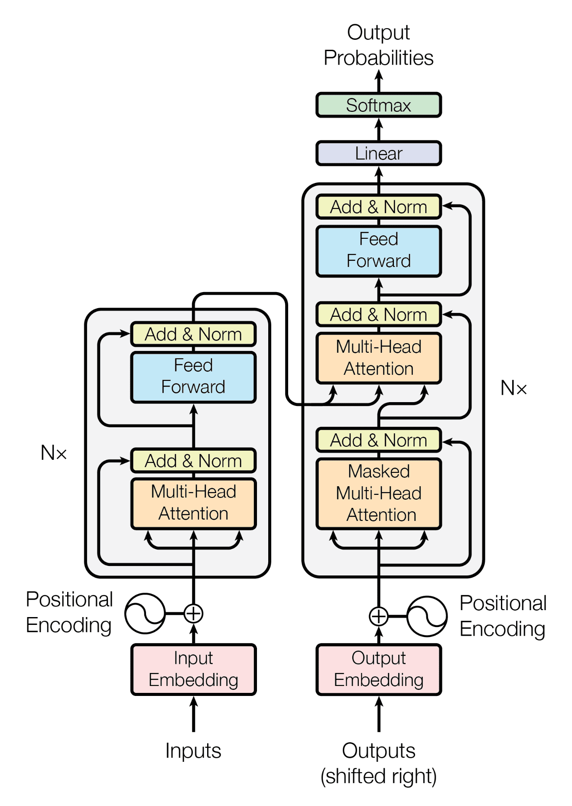 

 *Fig: Transformer*  

# How to Use
> [Notebook](./JinaAi_webscrapping.ipynb) contains all the directions 

> [app.py](./app.py) contains the API implementation of how the html content can be scraped off
```html

html_content = """
<!DOCTYPE html>
<html lang="en">
<head>
    <meta charset="UTF-8">
    <meta name="viewport" content="width=device-width, initial-scale=1.0">
    <title>Product Page</title>
</head>
<body>
    <div class="product">
        <h1>Haylou LS02 Touch Screen Smart Watch</h1>
        <p>Description: A smart watch with heart monitoring, call alerts, and IP68 waterproofing.</p>
    </div>
</body>
</html>
"""
```
can be changed to the e-commerce site
> `pip install ollama` to download llama 
and `ollama pull llama3` to rull ollama3 locally and `ollama pull nomic-embed-text` to install open source embeddings

>[client.py](./client.py) contains the  proposed API implementaion fror the assessment (there can be issues for this) `pip install -r requirements.txt` to install the required library


# Libraries:
playwright , scrapegraphai==0.9.0b7 ,nest_asyncio, fastapi, uvicorn, transformers, pydentic, requests, beautifulsoup4, --quiet, tiktoken, prettytable, tqdm, nest_asyncio
# Problem Statement
The project applies machine learning skills, particularly in natural language processing (NLP), to solve a real-world problem(web-scraping). The main goal is to build an API in a way that extracts meaningful attributes from an HTML block of an e-commerce website using an open-source large language model (LLM). 
# Methodology 
- **Ollama**


With the help of the Ollama framework, running potent language models locally is simple. Embeddings are a transformative technology in natural language processing, enabling applications to understand and process text semantics at a deep level. By supporting embedding models, Ollama significantly enhances the capabilities of developers and companies to create intelligent and responsive applications.
`ollama/nomic-embed-text` is a flexible option for embedding generation because of its exceptional ability to handle both short and long context tasks. This methodology offers developers an additional degree of openness and dependability because it is open source, fully replicable, and open data.
- **Llama3**

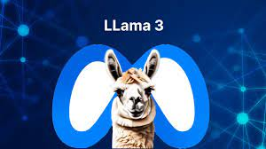

Ollama's Llama 3 is a significant update from its predecessor, Llama 2, featuring substantial improvements and new capabilities. Llama 3 has been trained on a dataset seven times larger than Llama 2, and it boasts double the context length at 16,000 tokens. Additionally, it includes a more efficient language encoding system with a larger token vocabulary and exhibits fewer false refusals compared to Llama 2.

For web scraping purposes, Llama 3 can greatly improve textual data extraction, analysis, and comprehension from web sites. Llama 3 may be used to precisely parse complex web material and retrieve pertinent data, like as product details from e-commerce sites or summary points from publications. Llama 3 may also be used for categorizing information, identifying identified entities like as individuals, organizations, and dates, and summarizing lengthy documents. This capability is particularly useful for applications like building databases, extracting contact information, or handling complex queries related to the scraped data.
- **ScrapeGraphAI**

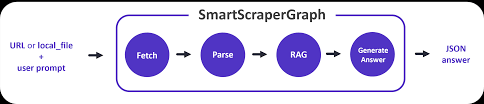

Using LLMs and direct graph logic, ScrapeGraphAI is a potent Python web scraping package that can be used to build scalable and effective scraping pipelines for local documents and websites. This method creates more intelligent and adaptable data extraction methods by fusing the structural efficiency of graph logic with the semantic comprehension powers of LLMs.
The llm section specifies the use of the "ollama/llama3" model, setting parameters such as temperature to 0 for deterministic outputs and the format to "json" for structured responses. The base_url is set to "http://localhost:11435", indicating where the LLM is hosted. This allows the library to send HTTP requests to this endpoint, where the LLM processes the input text based on the given prompt and returns a JSON response.

Similarly, the embeddings section configures the use of the "ollama/nomic-embed-text" model, also hosted at "http://localhost:11435". This model converts text into numerical vectors that capture semantic meanings, useful for tasks like similarity searches. The verbose key, set to True, enables detailed logging for debugging purposes, providing insights into the library’s operations and interactions with the models.
- Jina AI
Jina AI is an open-source project focused on building an ecosystem for neural search. It provides a cloud-native neural search framework to enable developers to build powerful search applications with state-of-the-art AI models. Jina AI offers tools and infrastructure for building scalable and customizable search solutions across various domains, including e-commerce, enterprise search, multimedia search, and more. With Jina AI, users can leverage the latest advancements in deep learning and distributed computing to create intelligent search systems that can understand and retrieve information from large-scale datasets efficiently.
# Api Implementation
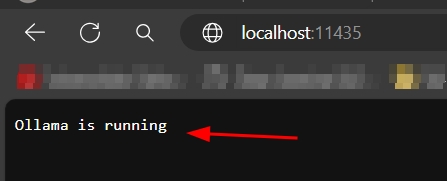
```
graph_config = {
    "llm": {
        "model": "ollama/llama3",
        "temperature": 0,
        "format": "json",
        "base_url": "http://localhost:11435",
    },
    "embeddings": {
        "model": "ollama/nomic-embed-text",
        "base_url": "http://localhost:11435",
    },
    "verbose": True,
} 
```
The graph_config dictionary in the provided code is a configuration setup for LLM and embedding model hosted locally via API endpoints. This configuration allows the library to utilize the models for extracting and processing data from web pages or HTML content.The API implementation involves hosting the specified models locally and making them accessible via HTTP endpoints. These endpoints allow the ScrapeGraphAI library to send HTTP requests to the models for processing tasks. 
The other implementation includes extracting contents from BeautifulSoup and passing it to JinaAI
<!-- 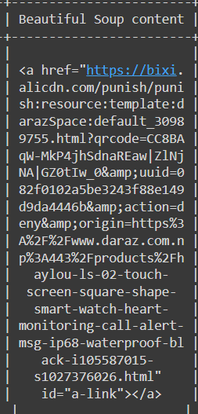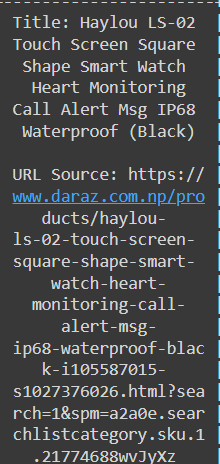 -->
In this context, Beautiful Soup helps to fetch and parse HTML which retrieves the HTML content of a web page and parses it into a tree structure.
Using its querying capabilities,Jina AI helps to  search for specific tags, attributes, and text within the HTML structure. This makes it easier to extract the precise data you need from a web page, such as text within paragraph tags, titles, or any other HTML elements.


# Result
Json returned from one of the [daraz site](https://www.daraz.com.np/products/haylou-ls-02-touch-screen-square-shape-smart-watch-heart-monitoring-call-alert-msg-ip68-waterproof-black-i105587015-s1027376026.html?spm=a2a0e.searchlistcategory.sku.1.21774688wvJyXz&search=1)
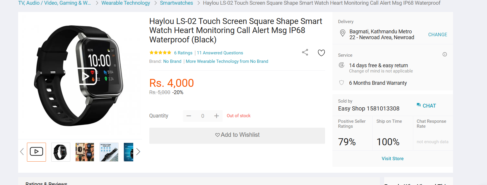
The json retrieved from the LLM is:
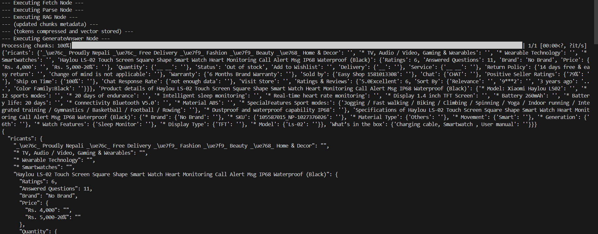
```
{'ricants': {'_\ue76c_ Proudly Nepali _\ue76c_ Free Delivery _\ue7f9_ Fashion _\ue7f9_ Beauty _\ue768_ Home & Decor': '', '* TV, Audio / Video, Gaming & Wearables': '', '* Wearable Technology': '', '* 
Smartwatches': '', 'Haylou LS-02 Touch Screen Square Shape Smart Watch Heart Monitoring Call Alert Msg IP68 Waterproof (Black)': {'Ratings': 6, 'Answered Questions': 11, 'Brand': 'No Brand', 'Price': {'Rs. 4,000': '', 'Rs. 5,000-20%': ''}, 'Quantity': {'__ __': ''}, 'Status': 'Out of stock', 'Add to Wishlist': '', 'Delivery': {'__': ''}, 'Service': {'__ __': ''}, 'Return Policy': {'14 days free & easy return': '', 'Change of mind is not applicable': ''}, 'Warranty': {'6 Months Brand Warranty': ''}, 'Sold by': {'Easy Shop 1581013308': ''}, 'Chat': {'CHAT': ''}, 'Positive Seller Ratings': {'79%': ''}, 'Ship on Time': {'100%': ''}, 'Chat Response Rate': {'not enough data': ''}, 'Visit Store': '', 'Ratings & Reviews': {'5.0Excellent': 6, 'Sort By': {'Relevance': '', '9***2': '', '3 years ago': '...', 'Color Family:Black': ''}}}, 'Product details of Haylou LS-02 Touch Screen Square Shape Smart Watch Heart Monitoring Call Alert Msg IP68 Waterproof (Black)': {'* Model: Xiaomi Haylou LS02': '', '* 
12 sports modes': '', '* 20 days of endurance': '', '* Intelligent sleep monitoring': '', '* Real-time heart rate monitoring': '', '* Display 1.4 inch TFT Screen': '', '* Battery 260mAh': '', '* Battery life: 20 days': '', '* Connectivity Bluetooth V5.0': '', '* Material ABS': '', '* SpecialFeatures Sport modes:': {'Jogging / Fast walking / Biking / Climbing / Spinning / Yoga / Indoor running / Integrated training / Gymnastics / Basketball / Football / Rowing': ''}, '* Dustproof and waterproof capability IP68': ''}, 'Specifications of Haylou LS-02 Touch Screen Square Shape Smart Watch Heart Monitoring Call Alert Msg IP68 Waterproof (Black)': {'* Brand': {'No Brand': ''}, '* SKU': {'105587015_NP-1027376026': ''}, '* Material Type': {'Others': ''}, '* Movement': {'Smart': ''}, '* Generation': {'6th': ''}, '* Watch Features': {'Sleep Monitor': ''}, '* Display Type': {'TFT': ''}, '* Model': {'Ls-02': ''}}, 'What’s in the box': {'Charging cable, Smartwatch , User manual': ''}}}
{
  "ricants": {
    "_\ue76c_ Proudly Nepali _\ue76c_ Free Delivery _\ue7f9_ Fashion _\ue7f9_ Beauty _\ue768_ Home & Decor": "",
    "* TV, Audio / Video, Gaming & Wearables": "",
    "* Wearable Technology": "",
    "* Smartwatches": "",
    "Haylou LS-02 Touch Screen Square Shape Smart Watch Heart Monitoring Call Alert Msg IP68 Waterproof (Black)": {
      "Ratings": 6,
      "Answered Questions": 11,
      "Brand": "No Brand",
      "Price": {
        "Rs. 4,000": "",
        "Rs. 5,000-20%": ""
      },
      "Quantity": {
        "__ __": ""
      },
      "Status": "Out of stock",
      "Add to Wishlist": "",
      "Delivery": {
        "__": ""
      },
      "Service": {
        "__ __": ""
      },
      "Return Policy": {
        "14 days free & easy return": "",
        "Change of mind is not applicable": ""
      },
      "Warranty": {
        "6 Months Brand Warranty": ""
      },
      "Sold by": {
        "Easy Shop 1581013308": ""
      },
      "Chat": {
        "CHAT": ""
      },
      "Positive Seller Ratings": {
        "79%": ""
      },
      "Ship on Time": {
        "100%": ""
      },
      "Chat Response Rate": {
        "not enough data": ""
      },
      "Visit Store": "",
      "Ratings & Reviews": {
        "5.0Excellent": 6,
        "Sort By": {
          "Relevance": "",
          "9***2": "",
          "3 years ago": "...",
          "Color Family:Black": ""
        }
      }
    },
    "Product details of Haylou LS-02 Touch Screen Square Shape Smart Watch Heart Monitoring Call Alert Msg IP68 Waterproof (Black)": {
      "* Model: Xiaomi Haylou LS02": "",
      "* 12 sports modes": "",
      "* 20 days of endurance": "",
      "* Intelligent sleep monitoring": "",
      "* Real-time heart rate monitoring": "",
      "* Display 1.4 inch TFT Screen": "",
      "* Battery 260mAh": "",
      "* Battery life: 20 days": "",
      "* Connectivity Bluetooth V5.0": "",
      "* Material ABS": "",
      "* SpecialFeatures Sport modes:": {
        "Jogging / Fast walking / Biking / Climbing / Spinning / Yoga / Indoor running / Integrated training / Gymnastics / Basketball / Football / Rowing": ""
      },
      "* Dustproof and waterproof capability IP68": ""
    },
```

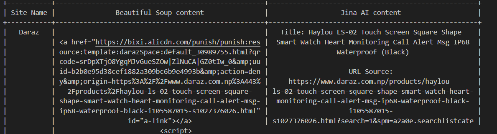
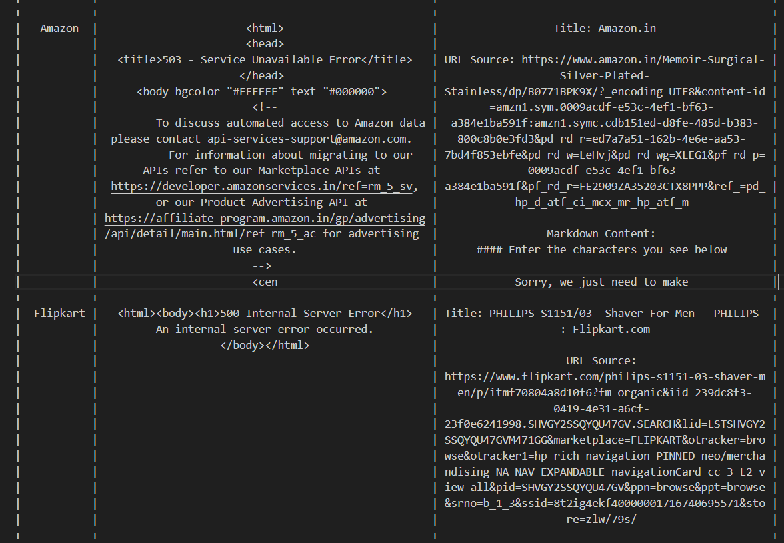
 The result shows a flexible framework for scraping content from various websites, calculating associated costs, and presenting the results in a structured manner. By integrating an open-source LLM into the provided codebase, we can develop an API capable of extracting meaningful attributes from HTML content ,even from the link of an e-commerce context, thus addressing the requirements of the assessment task.
# Conclusion
However, the open source LLMs are really slow that is why companies prefer OpenAI for the fast scraping
Using chatgpt as the API by feeding the HTML contents and processing it:
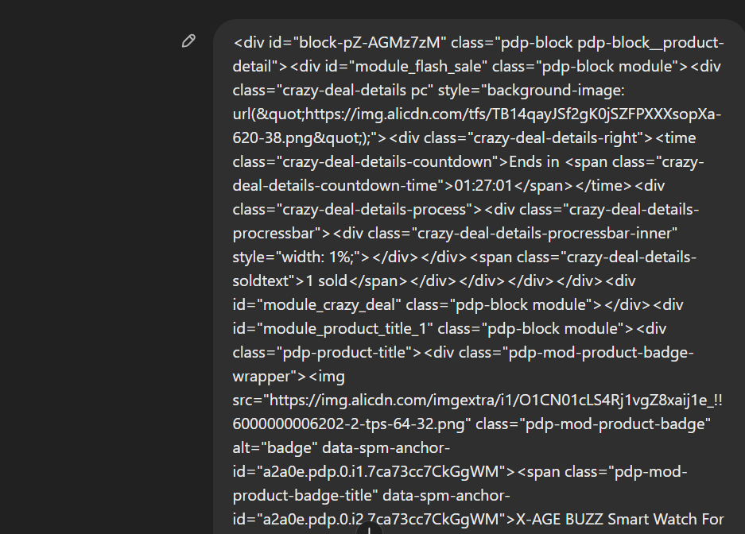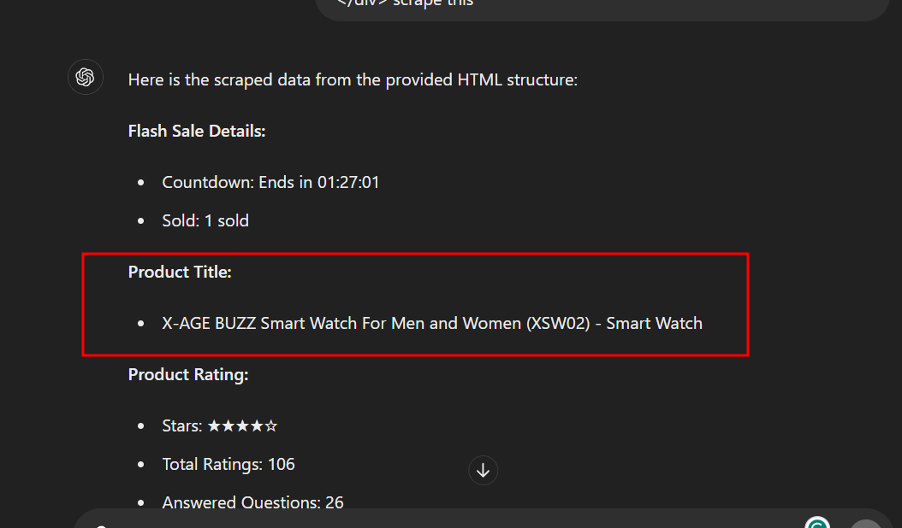

There can be hallucination after the prompting too:
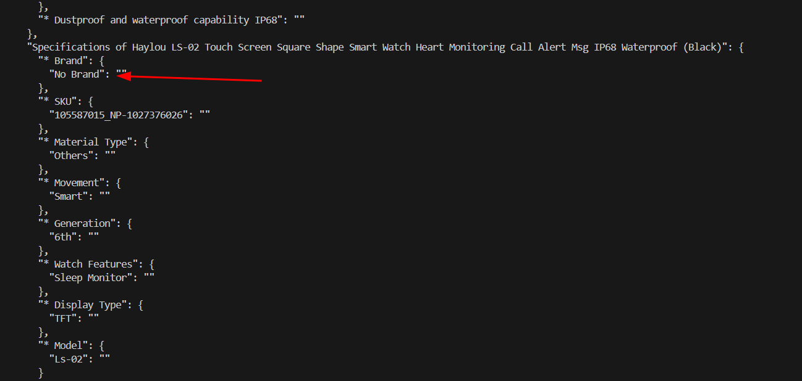
Fig : Hallucination with the LLM

# Refences
1. https://medium.com/@amanatulla1606/llm-web-scraping-with-scrapegraphai-a-breakthrough-in-data-extraction-d6596b282b4d
2. https://www.youtube.com/watch?v=2BTI3KIiGHU